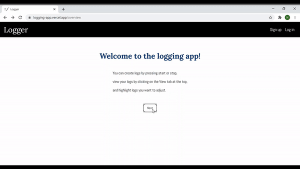

# Logger

An application for logging start and stop times. Organize logs into projects and view past logs. Logs are shown in you're time zone (but they are stored in UTC).

This application was written using React, Node.js, and PostgreSQL.

[site]: https://logging-app.vercel.app/

## Table of contents

- [Demo](#demo)
- [Log](#log)
- [API](#api)
- [Technologies](#technologies)
- [Acknowledgments](#acknowledgments)
- [Links](#links)

## Demo

A demo using the demo account → logger → formatting → viewing logs.

## Log

You can create logs and projects, or view them with the [logger][site]! You'll need to create an account or use the demo account (a shared account) to start making logs. With your own account you can create projects to store logs in. With the demo account, you won't be able to make new projects or update account settings, but you can use the rest of the features.

Try making your first log! Feel free to close the window while a log is running. It will keep running until you end it. You'll be able to make one log in a project at a time, but you can run logs in multiple projects simultaneously. When you've created some logs, the logs you've made for the current day will be shown below. You can format your logs by selecting them and entering a format. They adjust to the closest multiple of the minutes/seconds you enter (5 minutes → 0|5|10|15|20|25...minutes, 50 seconds → 0|50 seconds). View previous logs by clicking the view tab, opening the sidebar, and selecting which projects you want to view logs from or specific years, months, or days. The calendar will gray out areas you don't have logs.

## API

Base URL: `https://tranquil-chamber-25203.herokuapp.com/api`

- `/logs` Endpoint 
	- GET
		- `/logs?filter=range&start=*start_range*&end=*end_range*`
			- Get user's logs starting, ending, or running during the range.
		- `/logs?filter=projects-and-ranges&selectors=*selectors*`
			- Get user's logs filtered by project and ranges.
	- POST
		- `/logs`
			- Create a new log, given a project id and start time.
	- PATCH 
		- `/logs?filter=ids&part=format`
			- Update log formats, given log ids and the format.
		- `/logs/:log_id?part=end-time`
			- End a log, given an end time.

- `/projects` Endpoint
	- GET
		- `/projects`
			- Get all the user's projects.
		- `/projects?part='day-ranges'`
			- For each project, get all the ranges when user has logs.
		- `/projects/:project_id`
			- Get a user's project, given a project id.
		- `/projects/logs`
			- Get a user's project logs.
	- POST
		- `/projects`
			- Create a new project, given a project title.
- `/users` Enpoint
	- POST 
		- `/users`
			- Create a new user, given an email, password, and name.
	- PATCH
		- `/users`
			- Update a user's email and/or password, given an email and/or password.
	- DELETE
		- `/users`
			- Delete a user.
- `/auth` Endpoint
	- POST
		- `/auth/login`
			- Login a user.
		- `/auth/refresh`
			- Refresh a user's JWT.

[GitHub page](https://github.com/nickjang/logging-api) for the server.

## Technologies

This application was written using React, Node.js, Express, PostgreSQL, Mocha/Chai, Jest/Enzyme, JWT, and CSS.

[react-datetime](https://www.npmjs.com/package/react-datetime) is the calendar used to take user inputs on when to view logs from.

## Acknowledgments

Thank you to [Thinkful](https://thinkful.com/), where this capstone was completed.

## Links

* [The logging application][site]
* [Logger's server GitHub page](https://github.com/nickjang/logging-api)